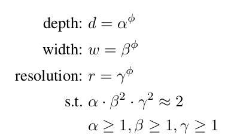
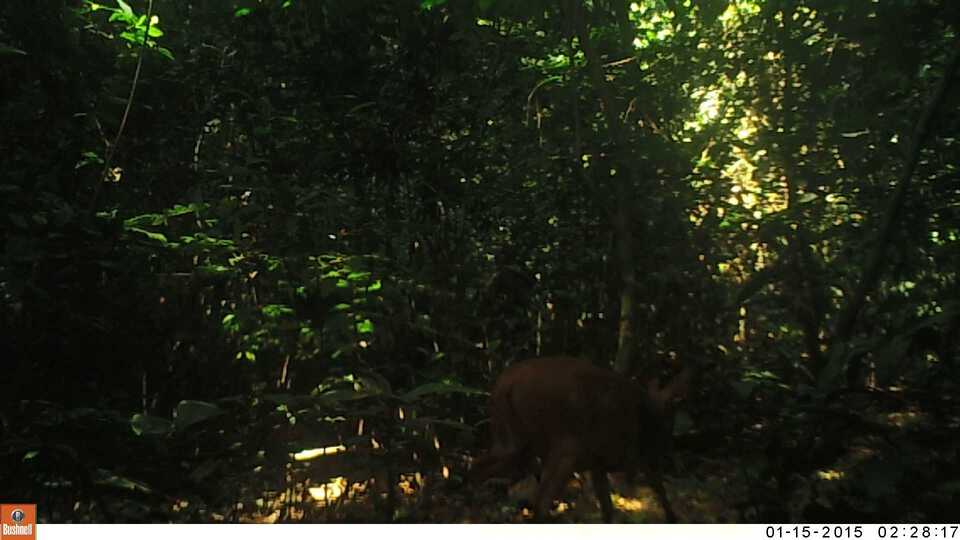
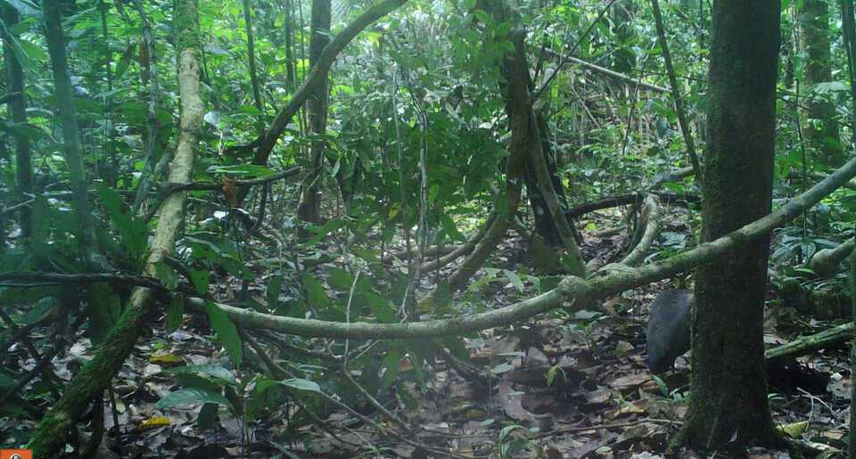
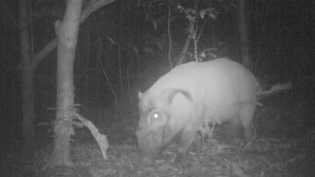
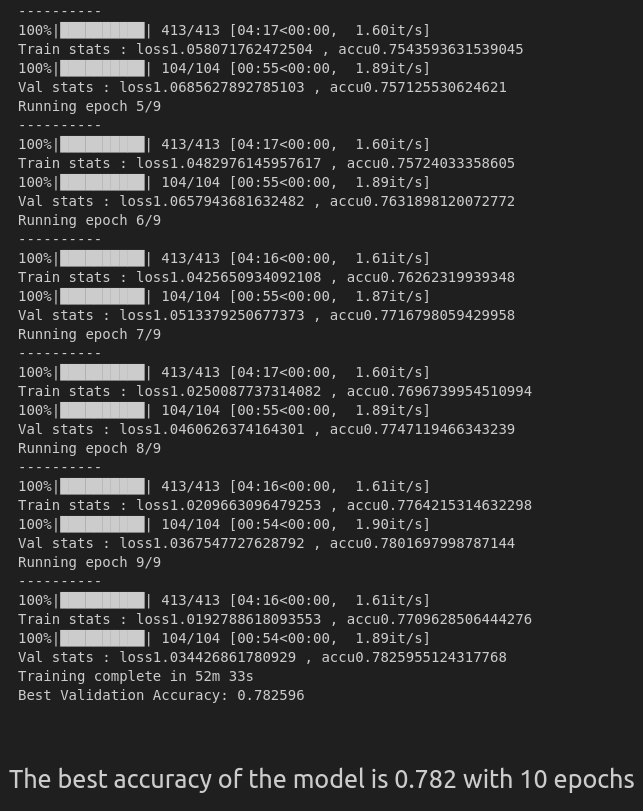

# Efficientnetb7-Pytroch- Conser-vision Practice Area: Image Classification 

# What is Efficientnet ?
Take a quick look at the offcial paper where I have highlighted the key points in it. [docs](docs/Efficientnet.pdf)

# Key Take Aways !
1. Efficientnet uses the Compound Scaling Method to Scale the depth , width and resolution.
2. The compound scaling method makes sense be-
cause if the input image is bigger, then the network needs
more layers to increase the receptive field and more channels
to capture more fine-grained patterns on the bigger image.
3. compound scaling method, uses a compound coefficient φ to uniformly scales
network width, depth, and resolution in a principled way.

     

# Problem Description

Goal is to classify species in camera trap images collected by the Wild Chimpanzee Foundation and the Max Planck Institute for Evolutionary Anthropology. The images include birds, civets, duikers, hogs, leopards, monkeys, rodents, and empty images. Build a model to help researchers identify the species in these images.

These are some images from the challenge.
For a more in-depth understanding, look into the problem [link](https://www.drivendata.org/competitions/87/competition-image-classification-wildlife-conservation/page/483/)

# Output
## I achieved an accuracy of 0.782 with 10 epochs.   Look into the notebook for a complete walkthrough.

# References
1. Efficientnet Pytroch Implementation - [Github repo](https://github.com/Nithish-github/MachineLearning-DeepLearning-CodeComputer_Vision/42-EfficientNet_Pretrained_Pytorch_Covid_19_X_Rays.ipynb-for-my-YouTube-Channel/blob/e4f77617d8b4cded085295c95d16f9d3dc33d69a/Computer_Vision/42-EfficientNet_Pretrained_Pytorch_Covid_19_X_Rays.ipynb) 
